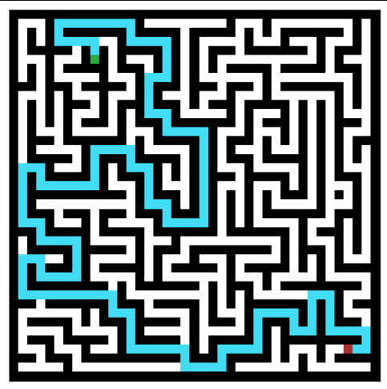

# Search and Adversarial AI

Implementation and evaluation of classical search and adversarial search algorithms in maze-based environments using Python.

## Overview

This project explores pathfinding and decision-making in dynamically generated maze environments. It combines classical search algorithms with adversarial search and includes experimental comparisons across different maze sizes.

### Pathfinding Example

Example path generated by Greedy Best-First Search with a Euclidean heuristic on a randomly generated maze.



## Implemented Methods

- Dijkstra's Algorithm
- Greedy Best-First Search
- A* Search
  - Euclidean heuristic
  - Manhattan heuristic
- Alpha-Beta Search for adversarial decision-making

## Algorithm Benchmarking

The search algorithms are evaluated across randomly generated mazes of increasing size using:

- Path length
- Number of expanded nodes

The experiments compare the efficiency and solution quality of different search strategies and heuristic functions.

## Adversarial Search

The project also introduces a competitive maze environment in which:

- An opponent uses A* search to pursue the agent.
- The agent uses Alpha-Beta search to select actions while balancing progress toward the goal and avoidance of the opponent.

This demonstrates the transition from single-agent pathfinding to decision-making in an adversarial environment.

## Technologies

- Python
- NumPy
- Matplotlib
- Jupyter Notebook

## Repository Structure

```text
search-and-adversarial-ai/
└── search_and_adversarial_ai.ipynb
